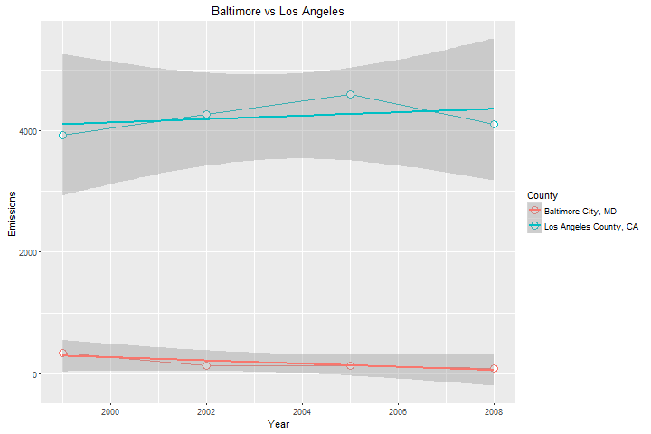

# Exploratory Data Analysis - Course Project
============================================
# Assignment 2
============================================


## Introduction

Fine particulate matter (PM2.5) is an ambient air pollutant for which there is strong evidence that it is harmful to human health. In the United States, the Environmental Protection Agency (EPA) is tasked with setting national ambient air quality standards for fine PM and for tracking the emissions of this pollutant into the atmosphere. Approximatly every 3 years, the EPA releases its database on emissions of PM2.5. This database is known as the National Emissions Inventory (NEI). You can read more information about the NEI at the [EPA National Emissions Inventory web site](http://www.epa.gov/ttn/chief/eiinformation.html).

For each year and for each type of PM source, the NEI records how many tons of PM2.5 were emitted from that source over the course of the entire year. The data that you will use for this assignment are for 1999, 2002, 2005, and 2008.

## Data

The data for this assignment are available from the course web site as a single zip file:
* [Data for Peer Assessment](https://d396qusza40orc.cloudfront.net/exdata%2Fdata%2FNEI_data.zip) [29Mb]

The zip file contains two files:
* SCC_PM25.rds
* Source_Classification_Code.rds

####SCC_PM25.rds
PM2.5 Emissions Data (`summarySCC_PM25.rds`): This file contains a data frame with all of the PM2.5 emissions data for 1999, 2002, 2005, and 2008. For each year, the table contains number of tons of PM2.5 emitted from a specific type of source for the entire year. Here are the first few rows.

```
##     fips      SCC Pollutant Emissions  type Year
## 4  09001 10100401  PM25-PRI    15.714 POINT 1999
## 8  09001 10100404  PM25-PRI   234.178 POINT 1999
## 12 09001 10100501  PM25-PRI     0.128 POINT 1999
## 16 09001 10200401  PM25-PRI     2.036 POINT 1999
## 20 09001 10200504  PM25-PRI     0.388 POINT 1999
## 24 09001 10200602  PM25-PRI     1.490 POINT 1999
```

* `fips`: A five-digit number (represented as a string) indicating the U.S. county
* `SCC`: The name of the source as indicated by a digit string (see source code classification table)
* `Pollutant`: A string indicating the pollutant
* `Emissions`: Amount of PM2.5 emitted, in tons
* `type`: The type of source (point, non-point, on-road, or non-road)
* `year`: The year of emissions recorded

####Source_Classification_Code.rds
Source Classification Code Table (`Source_Classification_Code.rds`): This table provides a mapping from the SCC digit strings int he Emissions table to the actual name of the PM2.5 source. The sources are categorized in a few different ways from more general to more specific and you may choose to explore whatever categories you think are most useful. For example, source “10100101” is known as “Ext Comb /Electric Gen /Anthracite Coal /Pulverized Coal”.

You can read each of the two files using the `readRDS()` function in R. For example, reading in each file can be done with the following code:

```
## This first line will likely take a few seconds. Be patient!
NEI <- readRDS("summarySCC_PM25.rds")
SCC <- readRDS("Source_Classification_Code.rds")
```

as long as each of those files is in your current working directory (check by calling `dir()` and see if those files are in the listing).

## Assignment

The overall goal of this assignment is to explore the National Emissions Inventory database and see what it say about fine particulate matter pollution in the United states over the 10-year period 1999–2008. You may use any R package you want to support your analysis.

### Questions

You must address the following questions and tasks in your exploratory analysis. For each question/task you will need to make a single plot. Unless specified, you can use any plotting system in R to make your plot.

1. Have total emissions from PM2.5 decreased in the United States from 1999 to 2008? Using the base plotting system, make a plot showing the total PM2.5 emission from all sources for each of the years 1999, 2002, 2005, and 2008.

2. Have total emissions from PM2.5 decreased in the Baltimore City, Maryland (`fips == "24510"`) from 1999 to 2008? Use the base plotting system to make a plot answering this question.

3. Of the four types of sources indicated by the `type` (point, nonpoint, onroad, nonroad) variable, which of these four sources have seen decreases in emissions from 1999–2008 for Baltimore City? Which have seen increases in emissions from 1999–2008? Use the ggplot2 plotting system to make a plot answer this question.

4. Across the United States, how have emissions from coal combustion-related sources changed from 1999–2008?

5. How have emissions from motor vehicle sources changed from 1999–2008 in Baltimore City?

6. Compare emissions from motor vehicle sources in Baltimore City with emissions from motor vehicle sources in Los Angeles County, California (`fips == "06037"`). Which city has seen greater changes over time in motor vehicle emissions?


### Making and Submitting Plots

For each plot you should
* Construct the plot and save it to a PNG file.
* Create a separate R code file (plot1.R, plot2.R, etc.) that constructs the corresponding plot, i.e. code in plot1.R constructs the plot1.png plot. Your code file should include code for reading the data so that the plot can be fully reproduced. You should also include the code that creates the PNG file. Only include the code for a single plot (i.e. plot1.R should only include code for producing plot1.png)
* Upload the PNG file on the Assignment submission page
* Copy and paste the R code from the corresponding R file into the text box at the appropriate point in the peer assessment.


###Questions 1
1. Have total emissions from PM2.5 decreased in the United States from 1999 to 2008? Using the base plotting system, make a plot showing the total PM2.5 emission from all sources for each of the years 1999, 2002, 2005, and 2008.

>**Answer**: Total emissions have decreased in the US from 1999 to 2008.

In preparation the data sets archive is downloaded and extracted:

```
# Check if the data is downloaded and download when applicable
if(!file.exists("data"))
  {dir.create("data")
  }
if(!file.exists(file.path("data","summarySCC_PM25.rds")) |
   !file.exists(file.path("data","Source_Classification_Code.rds")))
  {fileUrl <- "http://d396qusza40orc.cloudfront.net/exdata%2Fdata%2FNEI_data.zip"
   download.file(fileUrl, destfile = file.path("data", "exdata_data_NEI_data.zip"), mode = "wb")
   unzip(zipfile=file.path("data","exdata_data_NEI_data.zip"), exdir=file.path("data") )
  }
```

Load Packages

```
#load required libraries
library(plyr)
library(ggplot2)
library(data.table)
```

Load the NEI and SCC data frames from the .rds files.

```
## This first line will likely take a few seconds. Be patient!
NEI <- readRDS(file.path("data","summarySCC_PM25.rds"))
SCC <- readRDS(file.path("data","Source_Classification_Code.rds"))
```

Emissions is converted to "thousands of tons" for easier plotting.

```
#converted to "thousands of tons" for easier plotting
NEI$Emissions <- NEI$Emissions/1000
```

Aggregate total emissions from all sources across the United States by year


```
# aggregate total emissions from all sources by year
totalEmissions  <- with(NEI, aggregate(Emissions, by = list(year), sum))
totalEmissions
#  Group.1        x
#1    1999 7332.967
#2    2002 5635.780
#3    2005 5454.703
#4    2008 3464.206
```

Create the plot


```
#Create the plot
plot(totalEmissions, type = "b", pch = 18, col = "green", ylab = "Emissions (thousands of tons)", 
     xaxt="n", xlab = "Year", main = "Annual Emissions")
axis(side=1, at=c("1999", "2002", "2005", "2008"))

```

 


Save to PNG device


```
#save to PNG
dev.copy(png, file="plot1.png", width=720, height=480) 
# Close the PNG device
dev.off() 

```

As can see from the plot, total emissions have decreased in the US from 1999 to 2008.


###Questions 2
2. Have total emissions from PM2.5 decreased in the Baltimore City, Maryland (`fips == "24510"`) from 1999 to 2008? Use the base plotting system to make a plot answering this question.

>**Answer**: Yes, total emissions from PM2.5 on average have decreased in Baltimore City, Maryland from 1999 to 2008. 

Load the NEI data frames from the .rds files.


```
## This first line will likely take a few seconds. Be patient!
NEI <- readRDS(file.path("data","summarySCC_PM25.rds"))
```

Emissions is converted to "thousands of tons" for easier plotting.


```
#converted to "thousands of tons" for easier plotting
NEI$Emissions <- NEI$Emissions/1000
```


Restrict emissions data by Baltimore City, Maryland


```
# narrow the emissions data to Baltimore City, Maryland 
baltimore <- NEI[NEI$fips == "24510", ] 

```

Sum Emissions in the Baltimore City, Maryland from 1999 to 2008.


```
totalEmissions <-  aggregate(Emissions ~ year, baltimore, sum)
totalEmissions
#  year Emissions
#1 1999  3.274180
#2 2002  2.453916
#3 2005  3.091354
#4 2008  1.862282
```

Create the plot


```
#Create the plot
plot(totalEmissions$year,totalEmissions$Emissions, 
     main="Total emissions from PM[2.5] in Baltimore City, Maryland", 
     type = "b", col = "green", 
     xlab="Year", ylab="Emissions (thousand tons)",xaxt="n")
axis(side=1, at=c("1999", "2002", "2005", "2008"))
```

 


Save to PNG device

```
#save to PNG
dev.copy(png, file="plot2.png", width=720, height=480) 
# Close the PNG device
dev.off() 

```

As can see from the plot, total emissions from PM[2.5] have decreased 
overall in Baltimore City, Maryland from 1999 to 2008. 
There was a short-term upswing from 2002 to 2005, but the 
number declined overall during the reported time period.


###Questions 3
3. Of the four types of sources indicated by the  type  (point, nonpoint, onroad, nonroad) variable, which of these four sources have seen decreases in emissions from 1999–2008 for Baltimore City? Which have seen increases in emissions from 1999–2008? Use the ggplot2 plotting system to make a plot answer this question.

>**Answer**: The  NON-ROAD,  NON-POINT,  ON-ROAD  sources decreased emissions overall from 1999 to 2008.  POINT  has seen increases.

Data sets archive is downloaded and extracted in previouse Questions.

Load Packages

```
#load required libraries
library(plyr)
library(ggplot2)
library(data.table)
```

Load the NEI and SCC data frames from the .rds files.

```
## This first line will likely take a few seconds. Be patient!
NEI <- readRDS(file.path("data","summarySCC_PM25.rds"))
```

Emissions is converted to "thousands of tons" for easier plotting.

```
#converted to "thousands of tons" for easier plotting
NEI$Emissions <- NEI$Emissions/1000
```

Restrict emissions data by Baltimore City, Maryland


```
# narrow the emissions data to Baltimore City, Maryland 
baltimore <- NEI[NEI$fips == "24510", ] 
str(baltimore)
#'data.frame':   2096 obs. of  6 variables:
# $ fips     : chr  "24510" "24510" "24510" "24510" ...
# $ SCC      : chr  "10100601" "10200601" "10200602" "30100699" ...
# $ Pollutant: chr  "PM25-PRI" "PM25-PRI" "PM25-PRI" "PM25-PRI" ...
# $ Emissions: num  0.00653 0.07888 0.00092 0.01038 0.01086 ...
# $ type     : chr  "POINT" "POINT" "POINT" "POINT" ...
# $ year     : int  1999 1999 1999 1999 1999 1999 1999 1999 1999 1999 ...
head(baltimore)
#        fips      SCC Pollutant Emissions  type year
#114288 24510 10100601  PM25-PRI  0.006532 POINT 1999
#114296 24510 10200601  PM25-PRI  0.078880 POINT 1999
#114300 24510 10200602  PM25-PRI  0.000920 POINT 1999
#114308 24510 30100699  PM25-PRI  0.010376 POINT 1999
#114325 24510 30183001  PM25-PRI  0.010859 POINT 1999
#114329 24510 30201599  PM25-PRI  0.083025 POINT 1999
```

Aggregate emissions in the Baltimore City, Maryland by Years and Types.

```
baltimore.type <- ddply(baltimore, .(type, year), summarize, Emissions = sum(Emissions))
baltimore.type
#       type year  Emissions
#1  NON-ROAD 1999 0.52294000
#2  NON-ROAD 2002 0.24084692
#3  NON-ROAD 2005 0.24893369
#4  NON-ROAD 2008 0.05582356
#5  NONPOINT 1999 2.10762500
#6  NONPOINT 2002 1.50950000
#7  NONPOINT 2005 1.50950000
#8  NONPOINT 2008 1.37320731
#9   ON-ROAD 1999 0.34682000
#10  ON-ROAD 2002 0.13430882
#11  ON-ROAD 2005 0.13043038
#12  ON-ROAD 2008 0.08827546
#13    POINT 1999 0.29679500
#14    POINT 2002 0.56926000
#15    POINT 2005 1.20249000
#16    POINT 2008 0.34497518
```

Create the plot


```
#Create the plot
g <- ggplot(data=baltimore.type, aes(x=year, y=Emissions, group=type, color=type))
g + geom_line() + 
    geom_point( size=4, shape=21, fill="white") + 
    xlab("Year") + 
    ylab("Emissions (thousands of tons)") + 
    ggtitle("Baltimore Emissions PM2.5 by Type and Year")
```

 


Save to PNG device

```
#save to PNG
dev.copy(png, file="plot3.png", width=720, height=480) 
# Close the PNG device
dev.off() 

```
As can see from the plot, the  NON-ROAD,  NONPOINT,  ON-ROAD source types have all seen decreased emissions overall from 1999-2008 in Baltimore City.
The POINT source saw increase overall from 1999-2008. 
Also the  POINT source saw increase until 2005.
And it decreases again by 2008 to just above the starting values. 


###Questions 4
4. Across the United States, how have emissions from coal combustion-related sources changed from 1999–2008?

>**Answer**: Emissions from coal combustion related sources have decreased by about 40% from 1999-2008

Data sets archive is downloaded and extracted in previouse Questions.

Load Packages

```
#load required libraries
library(plyr)
library(ggplot2)
library(data.table)
```

Load the NEI and SCC data frames from the .rds files.

```
## This first line will likely take a few seconds. Be patient!
NEI <- readRDS(file.path("data","summarySCC_PM25.rds"))
SCC <- readRDS(file.path("data","Source_Classification_Code.rds"))
```

Emissions is converted to "thousands of tons" for easier plotting.

```
#converted to "thousands of tons" for easier plotting
NEI$Emissions <- NEI$Emissions/1000
```

First we subset coal combustion source factors from NEI and SCC data. Where Short.Name indicates emissions source—contains 'Coal'. 

```
# Coal combustion related sources
coalCombustion <- grep("coal", SCC$Short.Name, ignore.case = TRUE)
str(coalCombustion)
# int [1:239] 1 2 3 4 5 6 7 8 9 10 ...
combustionSCC <- SCC[coalCombustion,]$SCC
str(combustionSCC)
# Factor w/ 11717 levels "10100101","10100102",..: 1 2 3 4 5 6 7 8 9 10 ...
```

Subset coal combustion source factors NEI data

```
# Find emissions from coal combustion-related sources
combustionNEI <- NEI[NEI$SCC %in% combustionSCC,]
head(combustionNEI)
#      fips        SCC Pollutant Emissions     type year
#149  09001 2104001000  PM25-PRI     1.134 NONPOINT 1999
#2277 09003 2104001000  PM25-PRI     3.842 NONPOINT 1999
#4204 09005 2104001000  PM25-PRI     1.447 NONPOINT 1999
#5967 09007 2104001000  PM25-PRI     1.574 NONPOINT 1999
#7998 09009 2104001000  PM25-PRI     2.183 NONPOINT 1999
#9979 09011   10100217  PM25-PRI   479.907    POINT 1999
```

Aggregate total emissions from coal combustion-related sources across the United States by year

```
# group by year
totalEmissions <- aggregate(Emissions ~ year, data=combustionNEI, FUN=sum)
totalEmissions
#  year Emissions
#  1999  602.6241
#  2002  564.9400
#  2005  569.6547
#  2008  358.0839

```

Plot data with ggplot2

```
#create plot
g <- ggplot(data=totalEmissions, aes(x=factor(year), y=Emissions))  
g + geom_bar(stat="identity",fill="grey",width=0.75) + 
    geom_text(aes(label=round(Emissions,1), size=1, vjust=2)) +
    ggtitle("Total United States PM2.5 Coal Emissions") +
    ylab(expression("Emissions (thousands of tons)"))  + 
    xlab('Year') +
    theme(legend.position='none') 

``` 
 
 


Save to PNG device

```
#save to PNG
dev.copy(png, file="plot4.png", width=720, height=480) 
# Close the PNG device
dev.off() 

```

Emissions from coal combustion related sources have decreased from 600 thousands to below 370 thousands from 1999-2008.
And have decreased by about 40%.


###Questions 5
5. How have emissions from motor vehicle sources changed from 1999–2008 in Baltimore City?

>**Answer**: Emissions from motor vehicle sources have dropped from 1999-2008 in Baltimore City.

In preparation the data sets archive is downloaded and extracted:

```
# Check if the data is downloaded and download when applicable
if(!file.exists("data"))
  {dir.create("data")
  }
if(!file.exists(file.path("data","summarySCC_PM25.rds")) |
   !file.exists(file.path("data","Source_Classification_Code.rds")))
  {fileUrl <- "http://d396qusza40orc.cloudfront.net/exdata%2Fdata%2FNEI_data.zip"
   download.file(fileUrl, destfile = file.path("data", "exdata_data_NEI_data.zip"), mode = "wb")
   unzip(zipfile=file.path("data","exdata_data_NEI_data.zip"), exdir=file.path("data") )
  }
```

Load Packages

```
#load required libraries
library(plyr)
library(ggplot2)
library(data.table)
```

Load the NEI and SCC data frames from the .rds files.

```
## This first line will likely take a few seconds. Be patient!
NEI <- readRDS(file.path("data","summarySCC_PM25.rds"))
SCC <- readRDS(file.path("data","Source_Classification_Code.rds"))
```

Subset for motor vehicles in Baltimore

```
# Get Baltimore emissions from motor vehicle sources
baltimoreONROAD <- NEI[(NEI$fips=="24510") & (NEI$type=="ON-ROAD"),]


str(baltimoreONROAD)
#'data.frame':   1119 obs. of  6 variables:
# $ fips     : chr  "24510" "24510" "24510" "24510" ...
# $ SCC      : chr  "220100123B" "220100123T" "220100123X" "220100125B" ...
# $ Pollutant: chr  "PM25-PRI" "PM25-PRI" "PM25-PRI" "PM25-PRI" ...
# $ Emissions: num  7.38 2.78 11.76 3.5 1.32 ...
# $ type     : chr  "ON-ROAD" "ON-ROAD" "ON-ROAD" "ON-ROAD" ...
# $ year     : int  1999 1999 1999 1999 1999 1999 1999 1999 1999 1999 ...
head(baltimoreONROAD)
#        fips        SCC Pollutant Emissions    type year
#114470 24510 220100123B  PM25-PRI      7.38 ON-ROAD 1999
#114472 24510 220100123T  PM25-PRI      2.78 ON-ROAD 1999
#114477 24510 220100123X  PM25-PRI     11.76 ON-ROAD 1999
#114479 24510 220100125B  PM25-PRI      3.50 ON-ROAD 1999
#114481 24510 220100125T  PM25-PRI      1.32 ON-ROAD 1999
#114486 24510 220100125X  PM25-PRI      5.58 ON-ROAD 1999

```

Finally aggregate data for plot.

```
# aggregate total emissions from motor vehicle sources in Baltimore by year 
totalEmissions <- ddply(baltimoreONROAD, .(year), summarize, Emissions=sum(Emissions)) 
totalEmissions
#  year Emissions
#1 1999 346.82000
#2 2002 134.30882
#3 2005 130.43038
#4 2008  88.27546
```

Plot data with ggplot2

```
#create plot
g <- ggplot(data=totalEmissions, aes(x=factor(year), y=Emissions))  
g + geom_bar(stat="identity",fill="grey",width=0.75) + 
    geom_text(aes(label=round(Emissions,1), size=1, vjust=2)) +
    ggtitle("Emissions from motor vehicle sources in Baltimore City") +
    ylab(expression("Total Emissions PM2.5 (tons)"))  + 
    xlab('Year') +
    theme(legend.position='none') 

``` 
 
 


Save to PNG device

```
#save to PNG
dev.copy(png, file="plot5.png", width=720, height=480) 
# Close the PNG device
dev.off() 

```

Emissions from motor vehicle sources in Baltimore City have decreased in 4 times from 1999 to 2008.


###Questions 6
6. Compare emissions from motor vehicle sources in Baltimore City with emissions from motor vehicle sources in Los Angeles County, California (fips == "06037"). Which city has seen greater changes over time in motor vehicle emissions?

>**Answer**: Emission in Baltimore City has seen greater changes than in Los Angeles County. 40% decreased vs 4% rised.

In preparation the data sets archive is downloaded and extracted:

```
# Check if the data is downloaded and download when applicable
if(!file.exists("data"))
  {dir.create("data")
  }
if(!file.exists(file.path("data","summarySCC_PM25.rds")) |
   !file.exists(file.path("data","Source_Classification_Code.rds")))
  {fileUrl <- "http://d396qusza40orc.cloudfront.net/exdata%2Fdata%2FNEI_data.zip"
   download.file(fileUrl, destfile = file.path("data", "exdata_data_NEI_data.zip"), mode = "wb")
   unzip(zipfile=file.path("data","exdata_data_NEI_data.zip"), exdir=file.path("data") )
  }
```

Load Packages

```
#load required libraries
library(plyr)
library(ggplot2)
library(data.table)
```

Load the NEI and SCC data frames from the .rds files.

```
## This first line will likely take a few seconds. Be patient!
NEI <- readRDS(file.path("data","summarySCC_PM25.rds"))
SCC <- readRDS(file.path("data","Source_Classification_Code.rds"))
```

Subset for motor vehicles in Baltimore

```
# Get Baltimore emissions from motor vehicle sources
baltimoreONROAD <- NEI[(NEI$fips=="24510") & (NEI$type=="ON-ROAD"),]

str(baltimoreONROAD)
#'data.frame':   1119 obs. of  6 variables:
# $ fips     : chr  "24510" "24510" "24510" "24510" ...
# $ SCC      : chr  "220100123B" "220100123T" "220100123X" "220100125B" ...
# $ Pollutant: chr  "PM25-PRI" "PM25-PRI" "PM25-PRI" "PM25-PRI" ...
# $ Emissions: num  7.38 2.78 11.76 3.5 1.32 ...
# $ type     : chr  "ON-ROAD" "ON-ROAD" "ON-ROAD" "ON-ROAD" ...
# $ year     : int  1999 1999 1999 1999 1999 1999 1999 1999 1999 1999 ...
head(baltimoreONROAD)
#        fips        SCC Pollutant Emissions    type year
#114470 24510 220100123B  PM25-PRI      7.38 ON-ROAD 1999
#114472 24510 220100123T  PM25-PRI      2.78 ON-ROAD 1999
#114477 24510 220100123X  PM25-PRI     11.76 ON-ROAD 1999
#114479 24510 220100125B  PM25-PRI      3.50 ON-ROAD 1999
#114481 24510 220100125T  PM25-PRI      1.32 ON-ROAD 1999
#114486 24510 220100125X  PM25-PRI      5.58 ON-ROAD 1999

```

Subset for motor vehicles in Los Angeles

```
# Get Baltimore emissions from motor vehicle sources
LosAngelesONROAD <- NEI[(NEI$fips=="06037") & (NEI$type=="ON-ROAD"),]

str(LosAngelesONROAD)
#'data.frame':   978 obs. of  6 variables:
# $ fips     : chr  "06037" "06037" "06037" "06037" ...
# $ SCC      : chr  "2201001110" "2201001130" "2201001150" "2201001170" ...
# $ Pollutant: chr  "PM25-PRI" "PM25-PRI" "PM25-PRI" "PM25-PRI" ...
# $ Emissions: num  4.93 8.22 4.7 4.62 1.98 ...
# $ type     : chr  "ON-ROAD" "ON-ROAD" "ON-ROAD" "ON-ROAD" ...
# $ year     : int  1999 1999 1999 1999 1999 1999 1999 1999 1999 1999 ...
head(LosAngelesONROAD)
#         fips        SCC Pollutant Emissions    type year
#1541039 06037 2201001110  PM25-PRI      4.93 ON-ROAD 1999
#1541043 06037 2201001130  PM25-PRI      8.22 ON-ROAD 1999
#1541047 06037 2201001150  PM25-PRI      4.70 ON-ROAD 1999
#1541051 06037 2201001170  PM25-PRI      4.62 ON-ROAD 1999
#1541055 06037 2201001190  PM25-PRI      1.98 ON-ROAD 1999
#1541059 06037 2201001210  PM25-PRI      1.71 ON-ROAD 1999

```
Aggregate data for Baltimore.

```
# aggregate total emissions from motor vehicle sources in Baltimore by year 
totalEmissionsBaltimore <- ddply(baltimoreONROAD, .(year), summarize, Emissions=sum(Emissions)) 
totalEmissionsBaltimore$County <- "Baltimore City, MD"
totalEmissionsBaltimore
#  year Emissions             County
#1 1999 346.82000 Baltimore City, MD
#2 2002 134.30882 Baltimore City, MD
#3 2005 130.43038 Baltimore City, MD
#4 2008  88.27546 Baltimore City, MD

```

Aggregate data for Los Angeles.

```
# aggregate total emissions from motor vehicle sources in Los Angeles by year 
totalEmissionsLosAngeles <- ddply(LosAngelesONROAD, .(year), summarize, Emissions=sum(Emissions)) 
totalEmissionsLosAngeles$County <- "Los Angeles County, CA"
totalEmissionsLosAngeles
#  year Emissions                 County
#1 1999  3931.120 Los Angeles County, CA
#2 2002  4273.710 Los Angeles County, CA
#3 2005  4601.415 Los Angeles County, CA
#4 2008  4101.321 Los Angeles County, CA

```


```
# aggregate total emissions from motor vehicle sources by year and county 
bothEmissions <- rbind(totalEmissionsBaltimore, totalEmissionsLosAngeles)
bothEmissions
  year  Emissions                 County
1 1999  346.82000     Baltimore City, MD
2 2002  134.30882     Baltimore City, MD
3 2005  130.43038     Baltimore City, MD
4 2008   88.27546     Baltimore City, MD
5 1999 3931.12000 Los Angeles County, CA
6 2002 4273.71020 Los Angeles County, CA
7 2005 4601.41493 Los Angeles County, CA
8 2008 4101.32100 Los Angeles County, CA
```

Plot a line chart of the summary data by county include the linear regression line to show overall trend 

```
g <- ggplot(data=bothEmissions, aes(x=year, y=Emissions, group=County, color=County))
g + geom_line() + 
    geom_point( size=4, shape=21, fill="white") + 
    geom_smooth(method="lm") +
    xlab("Year") + 
    ylab("Emissions ") + 
    ggtitle("Baltimore vs Los Angeles")
```

 
 


Save to PNG device

```
#save to PNG
dev.copy(png, file="plot6.png", width=720, height=480) 
# Close the PNG device
dev.off() 

```

Emissions from motor vehicle sources in Baltimore City have decreased in 4 times from 1999 to 2008 as counted in Question #5.
Against in Los Angeles, Emission small rise ~ 4%. Almost same as was.
